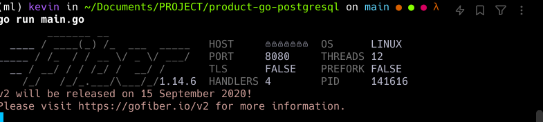
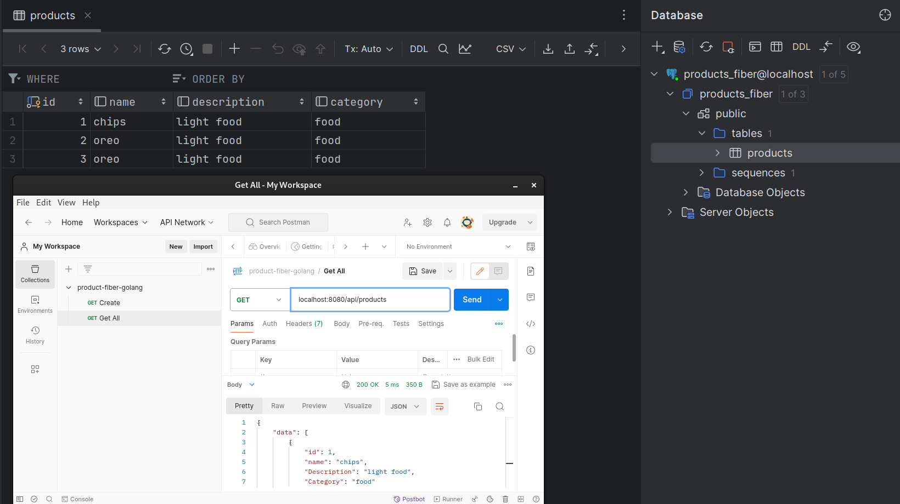

# CRUD PostgreSQL using Golang GORM

- How to run project?  
`go run main.go`  

    

- then open browser type `localhost:8080` then enter 
- or using postman to handle API

Result Project  

- Why i also include the .env?
this only dummy for learning purpose , but in production make sure do not include .env for security purpose

BY : KEVIN AVICENNA WIDIARTO